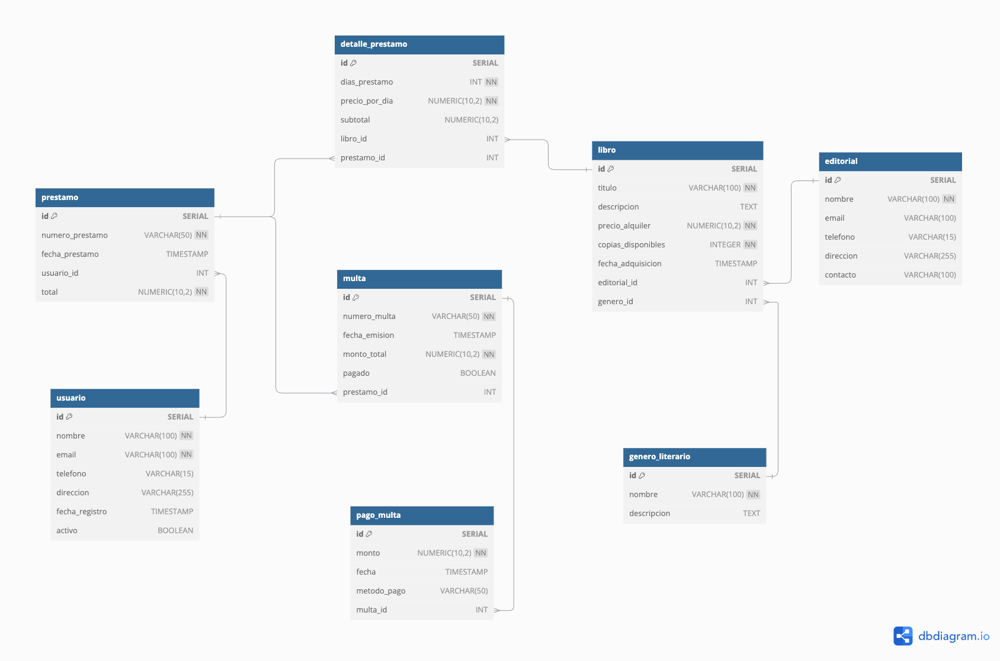

# 📚 BiblioTech - Sistema de Gestión de Biblioteca

## Presentación del caso
BiblioTech, una biblioteca en crecimiento, busca expandir sus servicios a múltiples sucursales a nivel nacional. Se requiere un sistema web que permita gestionar los préstamos y el control de sus libros. Todas las sucursales deberán tener acceso al sistema para mantener un control centralizado de los préstamos, usuarios y libros disponibles.

### Funcionalidades principales
* Registro de usuarios y sus datos de contacto
* Registro de libros y sus editoriales
* Registro de préstamos
* Registro de multas y pagos
* Control de inventario de libros


### Especificaciones técnicas
* Desarrollo con Spring Framework
* Implementación del patrón MVC
* Frontend con Bootstrap 5 usando JSP/Thymeleaf
* Gestión de base de datos mediante Spring Data JPA

## Fases del proyecto

### Fase 1: Consultas SQL
Utilizando el modelo relacional proporcionado, se requieren las siguientes consultas:



1. Obtener el total de préstamos por usuario en el mes de marzo, mostrando aquellos que han generado más de $50 en alquiler, ordenados por monto.
```sql
SELECT u.nombre, COUNT(p.id) as total_prestamos, SUM(p.total) as monto_total
FROM usuario u
        JOIN prestamo p ON u.id = p.usuario_id
WHERE p.fecha_prestamo >= '2024-03-01' AND p.fecha_prestamo < '2024-04-01'
GROUP BY u.id, u.nombre
HAVING SUM(p.total) > 50
ORDER BY monto_total DESC;
```

2. Listar libros con bajo stock (menos de 5 copias) junto con su editorial y género.
```sql
SELECT
   l.titulo,
   l.copias_disponibles,
   e.nombre as editorial,
   g.nombre as genero,
   l.precio_alquiler
FROM libro l
        JOIN editorial e ON l.editorial_id = e.id
        JOIN genero_literario g ON l.genero_id = g.id
WHERE l.copias_disponibles < 5
ORDER BY l.copias_disponibles ASC;
```

3. Mostrar multas pendientes de pago, incluyendo datos del usuario y monto adeudado.
```sql
SELECT u.nombre, u.email, m.numero_multa, m.fecha_emision, m.monto_total
FROM multa m
        JOIN prestamo p ON m.prestamo_id = p.id
        JOIN usuario u ON p.usuario_id = u.id
WHERE m.pagado = false;
```

4. Obtener los 5 libros más prestados, mostrando cantidad de préstamos y monto generado.
```sql
SELECT l.titulo, COUNT(dp.id) as total_prestamos, SUM(dp.subtotal) as monto_total
FROM libro l
        JOIN detalle_prestamo dp ON l.id = dp.libro_id
GROUP BY l.id, l.titulo
ORDER BY total_prestamos DESC
LIMIT 5;
```

5. Mostrar resumen de pagos de multas por método de pago del mes de marzo.
```sql
SELECT
   pm.metodo_pago,
   COUNT(*) as num_transacciones,
   SUM(pm.monto) as monto_total,
   ROUND(AVG(pm.monto), 2) as monto_promedio,
   MIN(pm.monto) as monto_minimo,
   MAX(pm.monto) as monto_maximo,
   COUNT(DISTINCT multa_id) as multas_distintas
FROM pago_multa pm
WHERE pm.fecha >= DATE_TRUNC('month', DATE '2024-03-01')
  AND pm.fecha < DATE_TRUNC('month', DATE '2024-03-01' + INTERVAL '1 month')
GROUP BY pm.metodo_pago
ORDER BY monto_total DESC;
```

### Fase 2: Algoritmos en Java

1. **Sistema de Alertas de Stock**
```java
public void verificarStockCritico(Long libroId) {
    Libro libro = libroRepository.findById(libroId)
        .orElseThrow(() -> new RuntimeException("Libro no encontrado"));
    
    int limiteMinimo = libro.getGenero().getNombre().equals("Académico") ? 8 : 5;
    
    if (libro.getCopiasDisponibles() < limiteMinimo) {
        System.out.println("¡ALERTA! Stock crítico para: " + libro.getTitulo());
        System.out.println("Copias disponibles: " + libro.getCopiasDisponibles());
        System.out.println("Se requiere reposición inmediata");
    }
}
```

2. **Cálculo de Préstamos por Usuario**
```java
public void calcularPrestamosPeriodo(Long usuarioId, int mes, int año) {
    LocalDate inicio = LocalDate.of(año, mes, 1);
    LocalDate fin = inicio.plusMonths(1).minusDays(1);
    
    List<Prestamo> prestamos = prestamoRepository
        .findByUsuarioIdAndFechaBetween(usuarioId, inicio, fin);
    
    double total = prestamos.stream()
        .mapToDouble(Prestamo::getTotal)
        .sum();
    
    System.out.println("Total de préstamos: $" + total);
}
```

### Fase 3: Implementación de Vista y API REST

#### Vista de Préstamos


**Funcionalidades:**
1. **Filtros:**
    - Rango de fechas de préstamo
    - Estado de la multa (Pagada/Pendiente)

2. **Tabla de Préstamos:**
    - Número de préstamo
    - Fecha
    - Usuario
    - Total
    - Estado de multa
    - Botón de detalle

3. **Vista de Detalle:**
    - Libros prestados
    - Días de préstamo
    - Precio por día
    - Subtotal
    - Información de multas

#### API REST
Endpoints disponibles:

```
GET /api/prestamos
Parámetros:
- fechaInicio (yyyy-MM-dd)
- fechaFin (yyyy-MM-dd)
- estadoMulta (PAGADA/PENDIENTE)

GET /api/prestamos/{id}/detalle
Respuesta: Detalle completo del préstamo
```

## Requisitos de Instalación
1. Java 11 o superior
2. PostgreSQL 12 o superior
3. Maven 3.6 o superior

## Configuración
1. Clonar el repositorio
2. Configurar la base de datos en `application.properties`
3. Ejecutar `mvn clean install`
4. Iniciar la aplicación con `mvn spring-boot:run`

## Contribución
1. Fork del repositorio
2. Crear rama feature (`git checkout -b feature/NuevaFuncionalidad`)
3. Commit de cambios (`git commit -m 'Agrega nueva funcionalidad'`)
4. Push a la rama (`git push origin feature/NuevaFuncionalidad`)
5. Crear Pull Request
